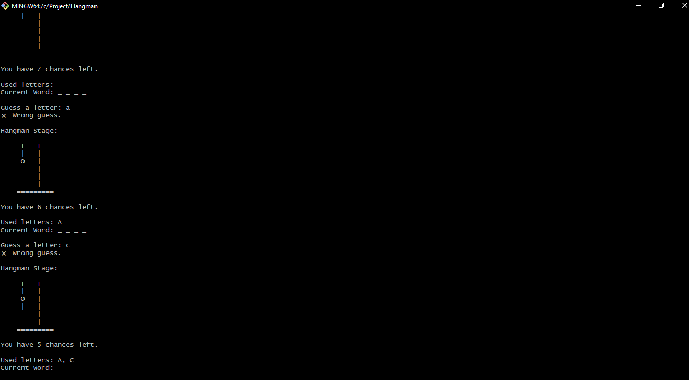

# 🕹️ Console Hangman Game

This is a classic Hangman game built with Python and playable in the terminal. The player must guess the hidden word one letter at a time before running out of chances.



## 🎯 Features

- Random word selection from a JSON word list
- ASCII-based hangman stages
- Input validation and user-friendly prompts
- Tracks guessed letters and remaining chances
- Clean, modular code with Python best practices

## How to Run

1. Clone the repository:
   ```bash
   git clone https://github.com/hussain-jawaid/Hangman-Game
   cd hangman-game
